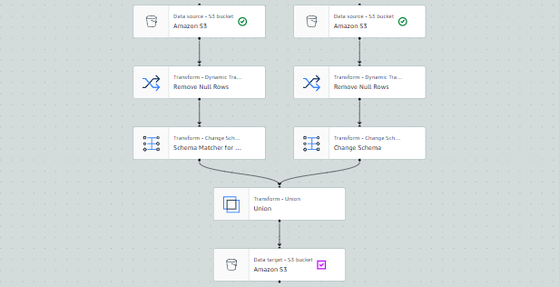

## Data Pipeline Workflow

The data pipeline leverages AWS Glue for ETL processing. Below is a visual representation of the Glue workflow:

### Steps:
1. **Data Extraction:** Data is ingested into S3.
2. **Data Transformation:** AWS Glue jobs clean and transform the raw data.
3. **Data Analysis:** Cleaned data is queried using Athena.
4. **Visualization:** Insights are visualized in QuickSight.
